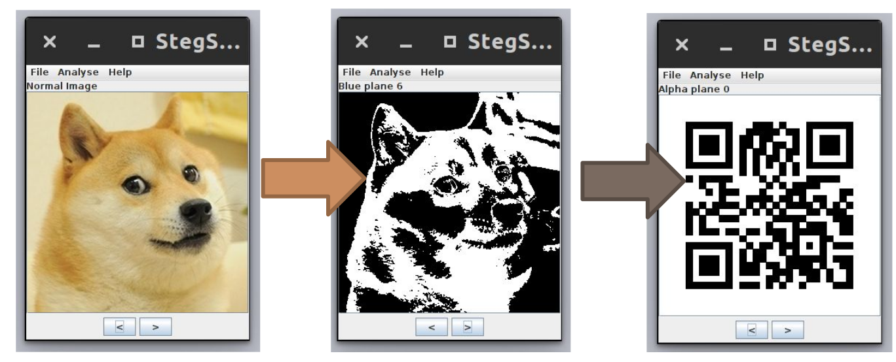

# Misc 150 - Wow Stegano

On récupère une image au format PNG que l’on analyse afin d’obtenir quelques informations
supplémentaires.

> swissky@crashlab▸ ~ ▸ $ -file ‘ESE Stega.png‘
ESE Stega.png: PNG image data, 300 x 300, 8-bit/color RGBA, non-interlaced

On lance stegsolve pour mettre en évidence d’éventuelles informations dans les Low Signicative Bits.

>java -jar Stegsolve.jar

En parcourant les différentes frames on découvre un QrCode dans la couche Alpha.

On obtient le flag en le décodant avec un smartphone ou sur des sites spécialisés :
**ese{St1ll_LSB_1n_2k16}**